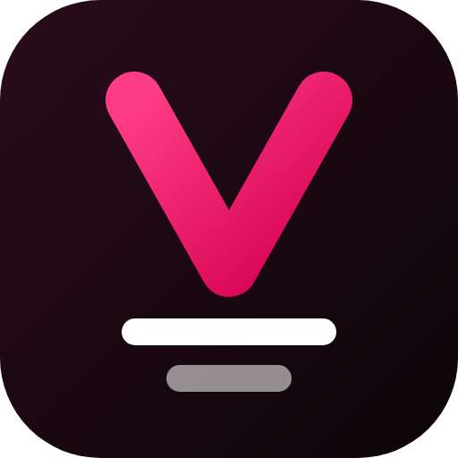

<p align="center"></p>

<h1 align="center">Velvo</h1>

<p align="center"><b>LG webOS televizyonlar için altyazı ve ses dilini seçebildiğin, ücretsiz ve açık kaynak IPTV oynatıcı.</b></p>

<p align="center"><a href="README.md">English</a> · Türkçe</p>

---

## Neden Velvo?

LG televizyonlardaki birçok IPTV oynatıcı, **dosyanın içindeki (gömülü) altyazı ve ses kanallarını** değiştiremiyor. Filmde on altyazı dili olsa bile ilk açılanla kalıyorsun. Velvo bu sorunu çözmek için yazıldı:

- Dosyanın içindeki kanalları okur.
- Hangi dillerin olduğunu sen oynatmaya basmadan gösterir.
- Oynatıcıdan değiştirmene izin verir.

Velvo ücretsizdir. Reklam, üyelik ya da takip yoktur.

## Özellikler

- **Kendi listen**: Xtream Codes API (sunucu, kullanıcı adı, şifre) ya da M3U/M3U8 liste adresi
- **Altyazı ve ses**:
  - İzlerken gömülü altyazı ve ses kanalını değiştirme
  - Detay sayfasında dil rozetleri (MKV dosyalarında oynatmadan önce tespit edilir)
  - Altyazı görünümü: boyut, renk, konum
  - Dizi başına ses/altyazı hafızası: seçimin sonraki bölümlerde otomatik uygulanır
- **TV'ye göre tasarım**:
  - Netflix tarzı, dinamik satırlı ana sayfa
  - Filmler, sezon ve bölümleriyle diziler, canlı TV, arama, Listem ve "izlemeye devam et"
  - Magic Remote ve normal kumandayla çalışır
- **Profiller**: herkesin kendi dil tercihleri, izleme ilerlemesi ve listesi
- **Arayüz dilleri**: Türkçe ve İngilizce. Uygulama, TV'nin diline göre birini otomatik seçer. [Kendi dilini ekle!](#çeviriler)

## Sorumluluk reddi

**Velvo yalnızca bir medya oynatıcıdır. Hiçbir kanal, film, dizi ya da liste içermez, sağlamaz, satmaz ve bunlara bağlantı vermez.**

Kullanma hakkına sahip olduğun bir sağlayıcıdan kendi listeni edinmen gerekir. Velvo projesi korsanlığı desteklemez. Hak sahibinin izni olmadan içerik izlemek ülkende yasa dışı olabilir; ne oynattığının sorumluluğu sana aittir. Projeyle gelen [demo liste](demo/velvo-demo.m3u) yalnızca açık lisanslı filmler ve herkese açık test yayınları içerir.

## Demo listeyle dene

Giriş ekranında **M3U**'yu seç ve şu adresi gir:

```
https://raw.githubusercontent.com/FTanBorn/velvo/main/demo/velvo-demo.m3u
```

Demo listedeki *Sintel* filminde 1 ses ve 10 gömülü altyazı dili var. Altyazı değiştirmeyi hemen deneyebilirsin.

## TV'ye kurulum (Geliştirici Modu)

Velvo henüz LG Content Store'da değil. O zamana kadar LG'nin ücretsiz geliştirici araçlarıyla kurabilirsin:

1. [webostv.developer.lge.com](https://webostv.developer.lge.com) adresinde ücretsiz bir hesap aç.
2. TV'de LG Content Store'dan **Developer Mode** uygulamasını kur. Bu hesapla giriş yap, *Dev Mode Status*'u aç ve TV'yi yeniden başlat.
3. Developer Mode uygulamasını tekrar aç ve *Key Server*'ı aç.
4. Bilgisayarında şu komutları çalıştır:

```bash
npm install -g @webos-tools/cli
```

```bash
ares-setup-device
```

TV'yi IP adresi, `9922` portu ve `prisoner` kullanıcısıyla ekle.

```bash
ares-novacom --device tv --getkey
```

Developer Mode uygulamasında görünen parolayı gir.

```bash
ares-package app -o dist
```

```bash
ares-install --device tv dist/*.ipk
```

Geliştirici Modu oturumu yaklaşık 50 saat sonra biter. Uygulamanın silinmemesi için Developer Mode uygulamasından *Extend* ile süreyi uzat.

## Uyumluluk

- Chrome 38 web motorlu LG 55SK7900 (2018) üzerinde test edildi. Daha yeni webOS TV'lerde de çalışması beklenir.
- **Ses değiştirme**, standart HTML5 `audioTracks` API'sini kullanır.
- **Gömülü altyazı**, webOS medya servisini (`luna://com.webos.media`) kullanır. Diğer açık kaynak webOS oynatıcıları da aynı yolu izler.
  - Bu servis resmi olarak belgelenmemiştir.
  - Desteklemeyen bir TV'de Velvo seçeneği gizler ve bunu açıkça söyler; sessizce hata vermez.

## Geliştirme

- Her şey `app/` klasöründen çalışır. Düz HTML, CSS ve JavaScript'tir; derleme adımı ya da framework yoktur.
- **Kod ES5 kalmalı.** Eski webOS TV'ler Chrome 38 kullandığı için bunlar orada çalışmaz:
  - JavaScript: `let`/`const`, ok fonksiyonları, template string, `Object.assign`, `Array.prototype.find`, `includes`, `startsWith`, `closest`
  - CSS: değişkenler, grid, flex `gap`
- Hızlı deneme için `app/index.html` dosyasını masaüstü tarayıcıda açabilirsin.
- TV'de hata ayıklamak için şunu çalıştır:

```bash
ares-inspect --device tv --app com.furkan.iptvtest --open
```

## Çeviriler

Arayüz Türkçe yazılır ve çalışırken çevrilir. Yeni bir dil eklemek için (örneğin Almanca):

1. `app/js/i18n.js` içine bir `DICT.de` sözlüğü ekle. `DICT.en`'i kopyalayıp değerleri çevir.
2. Bölüm numarası, süre gibi sayı içeren cümleler için `RULES.de` ekle.
3. `A.UI_LANGS` listesine `['de', 'Deutsch']` satırını ekle.

Katkılara (pull request) açığız.

## Yol haritası

- Gömülü altyazısı olmayan dosyalar için internetten altyazı (ör. OpenSubtitles)
- Canlı kanallar için yayın akışı (EPG)
- Daha fazla arayüz dili
- Samsung Tizen sürümü

## Lisans

Velvo, [GNU Genel Kamu Lisansı v3.0](LICENSE) ile lisanslanmıştır. Kullanabilir, inceleyebilir, paylaşabilir ve değiştirebilirsin. Değiştirilmiş bir sürümü dağıtırsan, o sürüm de aynı lisansla açık kaynak kalmalıdır.

Üçüncü taraf bileşenler ve demo içerik kaynakları [THIRD_PARTY_NOTICES.md](THIRD_PARTY_NOTICES.md) dosyasında listelenir.

## Gizlilik

Velvo hiçbir veri toplamaz. Liste bilgilerin ve tercihlerin TV'nde kalır. [Gizlilik politikasını](PRIVACY.md) oku (çevrim içi: [ftanborn.github.io/velvo/privacy.html](https://ftanborn.github.io/velvo/privacy.html)).
